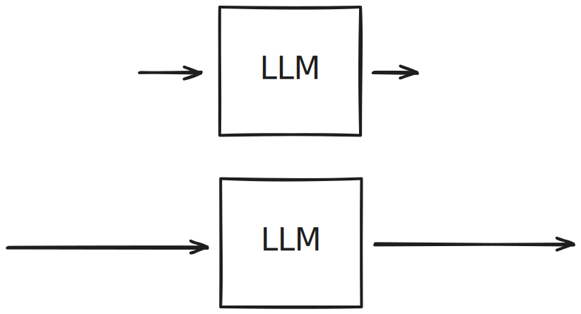

<!-- ---
marp: false
paginate: true
headingDivider: 2
header:
footer:
---

 -->

# Développeur·se : Se former à l'heure de l'IA

> Ma position et attitude face à l'IA et face à vous dans l'espace de formation.

## Personne ne sait vraiment où nous en sommes et nous allons

- L'IA pose (encore) un (nouveau) *défi* dans l'enseignement : vous évaluer ?, adhérence/dépendance du public à ces outils, etc.
- L'industrie **change** (manière de travailler), **ce que produit l'industrie non** (code, déployer et gérer des machines)
- Le métier de développeur·se ne va pas "disparaître", il évolue.

## L'IA n'est pas déterministe

<!--  -->

**Même input, jamais le même output !**

Dépend du modèle, des sources sur lesquelles elle a été entraînée, *wrapper/harness* (application cliente), etc.

## Une dépendance de plus

- Comme une librairie, vous **déléguez quelque-chose à quelqu'un d'autre**
- Vous en **dépendez**. *Quid* si en panne ? Plus maintenue ? Modèle économique/tarif vous échappe ?
- Une dépendance de plus, une raison de plus de casser

## L'IA ne produit pas le meilleur résultat, elle cherche à *vous satisfaire*

- IA n'est pas *magique*, **renseignez-vous sur le fonctionnement de ces systèmes** et restez critiques (dépasser l'effet "whaou" même s'il est impressionnant)
- IA est **baisée par son corpus d'entraînement** :
  - Beaucoup de données, problèmes connus et résolus des millions de fois : très bons résultats (hallucinations "positives")
  - Peu de données, problème moins connus, plus spécifiques : résultats mauvais, douteux et souvent incorrects ("hallucinations")
- Dans les deux cas, **l'IA vous donnera une réponse, avec beaucoup d'assurance !**.
- L'IA produit une réponse, **pas la meilleure possible pour votre use case** (sécurité, perfs, maintenabilité), ne s'embarrasse pas des compromis

## Là où l'IA brille

- Faire du *boilerplate* ou ce que vous avez déjà fait mille fois (et comprenez bien)
- Des modules d'applications web basiques
- Des applications *CRUD*
- Requêtes SQL classiques
- Trouver des bugs classiques
- **Discuter, explorer des sujets** (aller lire ensuite du contenu dessus)
- **Se créer des scripts** (shell, etc.)
- **Code review**, explication de commandes, d'outils bien documentés
- **Reformuler/Aide à l'écriture** : specifications, commentaires, doc

## Là où elle brille moins

- Designer et implémenter des UI complexes
- Le design avancé de systèmes
- La sécurité des applications web
- Le design de schémas de DB
- Débugage *profond*
- Réduction de la codebase

## Meilleur *input*, meilleur *output*

<!--  -->

La qualité de la réponse obtenue dépend de **la qualité de votre prompt** (input) !

## L'IA amplifie et met à l'échelle vos compétences, ce que *vous êtes et savez*

<!--  -->

- Ne négligez pas **les fondamentaux**, bien au contraire !
- Ce que produit l'IA est **le reflet de votre niveau de compétences** !
- Si vous faites mal votre travail, vous le ferez juste mal *plus vite*, *plus fort* !

## "Écrire" du code n'a >JAMAIS< été le problème

- Développer = **résoudre des problèmes spécifiques** pour vos clients en *designant* et *produisant* **un système fiable**, **compréhensible**, **sécurisé** et **performant**.
- Vous êtes ou allez devenir **des professionnel·es**, on attend de vous et on vous paie pour des produits de **qualité professionnelle** !

## Ce qui ne change pas

>"AI has not changed the way software is built. Code is written using the same syntax, version controlled using the same version control systems, compiled using the same compilers, deployed to the same servers, and neglected by the same developers." (Kesley Hightower)

## Ce qui ne change pas

>"Code has two distinct but intertwined purposes : **instructions** to a machine and a **conceptual model** of the problem domain" (Unmesh Joshi)

## Ce qui ne change pas

>"Computer science is a terrible name for this business... First of all, it's not a science... It's also not really very much about computers [...] The computer revolution is a revolution in the way we think and in the way we express what we think. The essence of this change is the emergence of what might best be called "procedural epistemology", the study of the structure of knowledge from an imperative point of view [...]. Computation provides a framework for dealing precisely with notions of **how to**" (Harold Abelson)

## Ce qui ne change pas

>"Programs must be written for people to read, and only incidentally for machines to execute." (Harold Abelson)

## Ce qui ne change pas : l'artefact, le code

- **Le code source** : que vous produisiez le code ou qu'un programme comme une IA le génère pour vous, cela ne change rien, à la fin, ce que **vous devez produire c'est un code**, un **programme**, qui une fois exécuté, **résoudra des problèmes**.

> On entend souvent que l'IA est une abstraction de plus, comme le C le fut sur les langages assembleurs. Je ne suis pas d'accord. Car la nature de l'artefact, contrairement à l'époque du passage à des langages *haut niveau*, ne change pas ! C'est toujours le même code, les mêmes primitives !

- **Programmer ce n'est (que) pas écrire du code**. "*Écrire* ce n'est pas taper à la machine" ! Toutes les personnes lettrées savent écrire. Tout le monde est-il écrivain ? Programmer c'est **réfléchir**, comprendre le **besoin**, **découvrir** les bonnes procédures, **designer** des systèmes, faire des **compromis**, déployer, monitorer.

## Ce qui ne change pas : le professionnalisme

- ***"Ça marche"* n'est pas suffisant !** **Tout le monde peut produire quelque chose qui "fonctionne" !** Produire quelque chose qui fonctionne correctement, de manière sécurisée, performante et qui peut évoluer n'est pas à la portée de tout le monde car cela demande de l'**expertise**.
- Le code : **instructions** et **modèle conceptuel du problème**. *How-to knowledge*
- Le code est **déterministe**, réservoir de déterminisme.

## IA ou pas, à la fin, VOUS êtes responsable

- Vous et **vous seul·e êtes responsable** du code que vous publiez !
- Aucune IA ne portera le blame en cas de problème !
- **La confiance est une affaire humaine**, ce n'est pas une question technologique.
- Soyez responsables de vos actes, auprès de **vos clients**, auprès de **vos collègues**.

## Faire la différence entre l'espace de formation (ici) et l'espace de production (entreprise)

- **Deux espaces** différents
- **Deux objectifs** différents
- Outils et méthodes différentes

## Faire la différence entre l'espace de formation (ici) et l'espace de production (entreprise)

- **Espace de formation** : **acquérir des compétences et du savoir (ensemble structuré de connaissances)**
  - Apprendre, avoir des retours
  - Faire des choses *manuellement*
  - Outils simples ou spécifiques
  - Problèmes et des systèmes **de petite taille**
  - Spécifications vous sont données (tp, examen, projet)

## Faire la différence entre l'espace de formation (ici) et l'espace de production (entreprise)

- **Espace de production** : **être productif**
  - Recueillir les besoins, spécifier une solution
  - Respecter contraintes (deadline, budget), compromis (qualité/coût)
  - **Communiquer**
  - Environnements et outils plus complexes
  - **Responsabilité**
  - Livrer, mettre en production, surveiller et maintenir
  - Travailler sur des grands systèmes complexes
  - Faire de la veille
  - **Acquérir de l'expérience**.
  - *Bonus* : Monter en compétences, apprendre des nouvelles choses

## Le biais de l'espace de formation

- Le temps est limité
- Exercices, TP, mini-projets, etc. : **petits systèmes**, systèmes **illustrant des points spécifiques**, **idéalisés**, **simplifiés**. **Loin des système réels** et *codebase* que vous rencontrerez en production
- Départ *from scratch*, loin des systèmes *legacy*
- **Problèmes classiques**, les bases, les fondamentaux
- **Le monde réel** est beaucoup plus **complexe** !

## En formation

- Ne vous faites pas avoir par le *contexte* : là pour **apprendre**, **pas produire** !
- Les problèmes que l'on aborde sont **connus**, les IA y sont *très* performantes. C'est un biais.

## En formation

- On y travaille sur des **problèmes connus** : vous formez à comprendre **des classes de problème**, le **fonctionnement des technologies** qui vont rester : protocoles, fondamentaux (web, compilation, etc.), certains langages, etc.
- **Apprendre à apprendre** !
- Réfléchir au *design*, aux *procédures*, à votre manière d'aborder des problèmes, de **comprendre les compromis**, **savoir faire des choix**
- On part toujours **du connu vers l'inconnu**

Si vous remettez tout à votre IA *maintenant*, dans cet *espace*, **quand** allez-vous vous former ?

## Conseils sur l'usage de l'IA en formation

- **Il y aura toujours du code** ! Si demain on va passer moins de temps à *écrire du code*, on va passer plus de temps à **gérer et juger du code** produit par l'IA. On a toujours passé plus de temps à lire et écrire du code ! **Comment juger de la qualité du code sans connaissances, ni expérience ?**
- **Les fondamentaux ont toujours et seront toujours importants** ! C'est ce qui fera de vous des meilleur·es programmeur·ses, IA ou non.
- L'IA produit (déjà) du **meilleur code que les humains** sur **des modules de très petite taille** (fonction)/ petites tâches. Pour cela, vous **devez savoir exactement ce que vous voulez et ne voulez PAS**. Comment allez-vous juger du résultat si vous n'avez pas de bases solides ? Vous allez tout "gober" ?
- L'IA est impressionnante, mais elle produit aussi de *très mauvaises choses* (*IA slop*) !
- Programmer et écrire du code : **acquérir du *how-to* knowledge** pour résoudre des nouveaux problèmes

## À long terme

- L'*impression* de comprendre, de maîtriser.
- **Dette cognitive** : *attention*, plus vous déléguez vos efforts mentaux aux IA, plus il vous sera difficile de réfléchir par vous-même et d'être critique !
- Si vous pensez que vous pouvez devenir un·e bon·ne programmeur·se (qualifié et professionnel) *sans passer par la friction de l'apprentissage* (*en vibant*), vous vous trompez !
- Si vous n'aimez pas : *programmer*, apprendre en permanence, écrire du code, *réfléchir*, résoudre des problèmes (conception, logique, techniques, etc.), ce métier ne va *pas* vous plaire.
- N'oubliez pas : *réfléchir*, *apprendre*, *faire des erreurs* cela vous **transforme** (association d'idées) et fait de la vie qu'elle vaut la peine d'être vécue !

<!-- 
Avant c'était bookmark un lien ou dl un PDF. aujourd'hui c'est l'IA
 -->

## Conseils sur l'usage de l'IA en formation

- **Écrivez votre code** ! C'est le meilleur et **unique moyen de comprendre**, tester, faire des erreurs, se forger des intuitions sur des processus, prendre du plaisir. Il se passe quelque-chose d'important dans votre tête quand vous implémentez une solution, c'est là que l'on découvre *la forme* du problème
- **Là pour apprendre, pas pour être productif !** Vous inquiétez pas, vous aurez tout le temps d'être productif en entreprise !
- N'utilisez pas d'IA pour les problèmes nouveaux, que vous n'avez pas essayé de comprendre d'abord ou déjà résolus
- **Lire**, **comprendre** et **vérifiez toutes les solutions, instructions proposées par l'IA**
- Des périodes régulières de **programmation sans l'aide de l'IA**. Faites *reviewer* **ensuite** votre code par une IA pour **découvrir** des failles dans votre code et votre raisonnement. Pour **apprendre**, **corriger**.
- Aux solutions proposées, **demandez s'il existe des solutions alternatives**. Plutôt que de demander à l'IA une réponse directe, lui demander **plusieurs approches** avec leurs **avantages et inconvénients**. Cela force la compréhension des compromis et produit souvent de meilleures réponses.

## À cette époque, quelle *valeur* allez-vous apporter ?

- Si vous pensez que l'IA et la maîtrise de ces outils suffit pour travailler sur des systèmes réels, *pourquoi* êtes-vous là? Un diplôme ?
- Si aujourd'hui vous pensez que n'importe qui peut produire et maintenir des systèmes, quelle est *votre valeur*?
- Vous savez utiliser les applis IA ? Utilisez des agents ? Plusieurs agents ? Vous avez un abonnement cher à un modèle puissant (ex: Claude Code) ? Vous travaillez *vite* ?

**N'importe qui, en quelques heures, peut posséder ces outils et ces compétences !** Vous n'avez jamais été aussi **remplaçables** !

## Conclusion

- Ne confondez pas **temps de formation** et **temps de production**
- Utilisez l'IA (comme moi) mais faites un usage **responsable** (à vous de voir !)
- N'oubliez pas les **intérêts des entreprises** à voir leur outils adoptés en masse ! Attention au *story-telling*
- Les personnes qui font des usages performants et utiles de l'IA sont des **gens formés**, qui ont des connaissances solides !
- Ne méprisez pas les fondamentaux, bien au contraire !
- Pour vous former à ce métier, **codez beaucoup et programmez !**
- Soyez créatifs et prenez du *plaisir* !