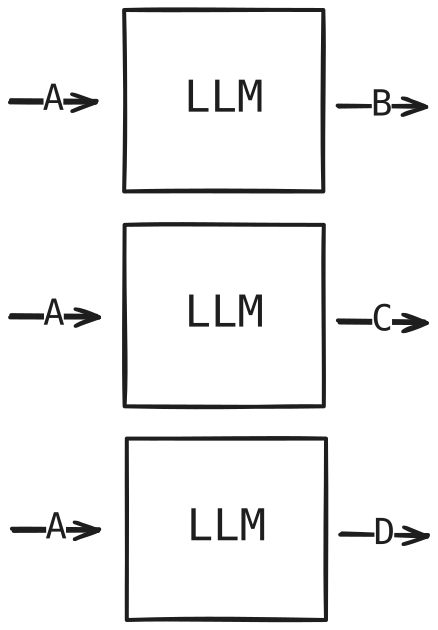
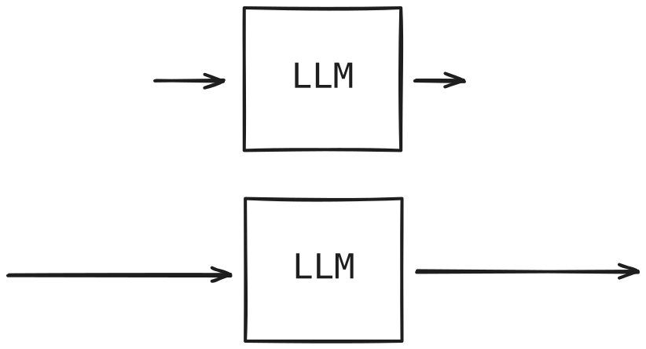
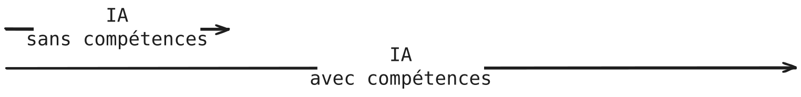

<!-- ---
marp: false
paginate: true
headingDivider: 2
header:
footer:
---

 -->

- [Programmation, développement informatique : se former à l'heure (à l'ère) de l'IA](#programmation-développement-informatique--se-former-à-lheure-à-lère-de-lia)
  - [Personne ne sait vraiment où nous en sommes et nous allons](#personne-ne-sait-vraiment-où-nous-en-sommes-et-nous-allons)
  - [Faut-il toujours apprendre et se former ?](#faut-il-toujours-apprendre-et-se-former-)
  - [Une dépendance de plus](#une-dépendance-de-plus)
  - [L'IA n'est pas déterministe](#lia-nest-pas-déterministe)
  - [L'IA ne produit pas le meilleur résultat, elle produit toujours un résultat et elle cherche à *vous satisfaire*](#lia-ne-produit-pas-le-meilleur-résultat-elle-produit-toujours-un-résultat-et-elle-cherche-à-vous-satisfaire)
  - [Là où l'IA brille](#là-où-lia-brille)
  - [Là où elle brille moins (à l'heure actuelle)](#là-où-elle-brille-moins-à-lheure-actuelle)
  - [L'IA amplifie et met à l'échelle vos compétences, ce que *vous êtes et savez*](#lia-amplifie-et-met-à-léchelle-vos-compétences-ce-que-vous-êtes-et-savez)
  - [Ce qui ne change pas: l'artefact à produire est toujours le même](#ce-qui-ne-change-pas-lartefact-à-produire-est-toujours-le-même)
  - [Code = spécifications](#code--spécifications)
  - [De l'importance d'écrire du code](#de-limportance-décrire-du-code)
  - [IA ou pas, en tant que professionnel, à la fin, VOUS êtes responsable](#ia-ou-pas-en-tant-que-professionnel-à-la-fin-vous-êtes-responsable)
  - [Dans ce nouveau contexte, quelle *valeur* allez-vous apporter ?](#dans-ce-nouveau-contexte-quelle-valeur-allez-vous-apporter-)
  - [Effets de l'usage "inconsidéré" de l'IA sur le long terme](#effets-de-lusage-inconsidéré-de-lia-sur-le-long-terme)
  - [Faire la différence entre l'espace de formation (ici) et l'espace de production (entreprise)](#faire-la-différence-entre-lespace-de-formation-ici-et-lespace-de-production-entreprise)
  - [Espace de formation : acquérir des compétences et du savoir (ensemble structuré de connaissances)](#espace-de-formation--acquérir-des-compétences-et-du-savoir-ensemble-structuré-de-connaissances)
  - [Espace de production : produire de la valeur](#espace-de-production--produire-de-la-valeur)
  - [Le biais de l'espace de formation](#le-biais-de-lespace-de-formation)
  - [Conseils sur l'usage de l'IA en formation](#conseils-sur-lusage-de-lia-en-formation)
  - [Conclusion](#conclusion)
  - [Quelques ressources utiles pour y réfléchir](#quelques-ressources-utiles-pour-y-réfléchir)
    - [Les *classiques*, plus d'actualité que jamais](#les-classiques-plus-dactualité-que-jamais)

# Programmation, développement informatique : se former à l'heure (à l'ère) de l'IA

> Ma position et attitude face à l'IA et face à vous dans l'espace de formation.

Le but de ce métier est de résoudre des problèmes spécifiques pour vos clients en *designant* et *produisant* un système (des programmes) *fiable*, *compréhensible*, *sécurisé* et *performant*. Vous êtes, ou allez devenir, *des professionnel·es*: on attend de vous (et on vous paie pour) des produits et des prestations de *qualité professionnelle*.

>"Computer science is a terrible name for this business... First of all, it's not a science... It's also not really very much about computers [...] The computer revolution is a revolution in the way we think and in the way we express what we think. The essence of this change is the emergence of what might best be called "procedural epistemology", the study of the structure of knowledge from an imperative point of view [...]. Computation provides a framework for dealing precisely with notions of *how to*" (Harold Abelson)

Programmer c'est :

- apprendre à réfléchir
- réfléchir
- comprendre
- recueillir et travailler des besoins
- analyser un problème (découper un nouveau problème en plusieurs petits problèmes connus ou trouver de nouveaux problèmes)
- découvrir les bons processus
- *designer* un système
- faire des *compromis*
- écrire du code (spécification)
- lire
- lire beaucoup de code
- communiquer
- déployer et monitorer (comprendre et corriger le comportement à l'exécution)
- utiliser des outils spécifiques

## Personne ne sait vraiment où nous en sommes et nous allons

- L'IA pose (encore) un (nouveau) *défi* à l'enseignement
- L'industrie change (manière de travailler), ce que produit l'industrie non (même code, mêmes machines, mêmes techniques)
- Le métier de développeur·se ne disparaît pas, il *change* (comme bien d'autres)
- Personne ne sait encore *comment* utiliser ces outils, expérimental, coûts/bénéfices

## Faut-il toujours apprendre et se former ?

> "Acquérir par l'étude, par la pratique, par l'expérience une connaissance, un savoir-faire, *quelque chose d'utile*." (Larousse)

Évidemment !

- Apprendre, c'est se *frotter* au réel. C'est *laborieux*, cela demande des *efforts*. De cette *friction*, naît une *véritable compréhension* des choses. Apprendre c'est acquérir de l'*expérience*. C'est au contact des contraintes, des échecs que des connaissances se transforment en *savoir*, savoir-*faire*, puis en *intuition*.
- Déléguez une tâche à l'IA c'est *pratique*, *efficace* (comme le côté obscur...) mais ça ne crée *aucune expérience* de la tâche en question. Vous n'apprenez *rien* à le faire.
- C'est vos *expériences* qui feront de vous quelqu'un·e d'*intéressant·e* (et avec qui on souhaiterait travailler !)
- Vous devez vous former à comprendre et résoudre *des classes de problèmes* et le *fonctionnement de technologies* (protocoles, compilateur, langages, algorithmes, etc.)
- Vous devez *apprendre à apprendre* !

## Une dépendance de plus

> "Programmers know the value of everything and the *cost* of nothing."" (Rich Hickey)

- Comme lorsque vous utilisez un langage, un framework, une library, vous *déléguez quelque-chose à quelqu'un d'autre*. Et ici ce n'est pas rien, vous déléguez **une capacité de raisonnement** et vos compétences ! Vous externalisez votre savoir-faire et votre capacité à réfléchir par vous-même
- Vous en **dépendez**. *Quid* si en panne ? Plus maintenue ? Modèle économique/tarif vous échappe ?
- Une dépendance de plus, une raison de plus de *casser* !

## L'IA n'est pas déterministe

<!--  -->

**Même input, jamais le même output !**

Dépend du modèle, des sources sur lesquelles elle a été entraînée, *wrapper/harness* (application cliente), etc.

## L'IA ne produit pas le meilleur résultat, elle produit toujours un résultat et elle cherche à *vous satisfaire*

- L'IA n'est pas *magique*, ces outils sont développés par des entreprises avec des intérêts précis, renseignez-vous sur le fonctionnement de ces systèmes et restez critiques
- L'IA est *biaisée* par son corpus d'entraînement :
  - Beaucoup de données, problèmes connus et résolus des millions de fois : très bons résultats (hallucinations "positives")
  - Peu de données, problème moins connus, plus spécifiques : résultats plus douteux et souvent incorrects ("hallucinations")
- Dans les deux cas, **l'IA vous donnera une réponse, avec beaucoup d'assurance !**
- L'IA produit *toujours* une réponse, *pas la meilleure possible* pour votre cas d'utilisation (sécurité, perfs, maintenabilité)
- L'IA peut *mentir* (contrairement à votre calculatrice ou votre compteur de vitesse). C'est la première fois dans l'histoire de l'humanité que vous devez apprendre à vous *méfier d'un outil*!

## Là où l'IA brille

- Faire du *boilerplate* ou ce que vous avez déjà fait mille fois (et comprenez bien)
- Implémenter des modules connus (*colorier le contenu des abstractions*)
- Explorer la documentation de technologies très utilisées
- Requêtes SQL classiques
- Trouver des bugs classiques
- **Discuter, explorer des sujets** (aller lire ensuite du contenu dessus), vous aider à aller du connu vers l'inconnu
- **Se créer des scripts** (shell, etc.)
- **Code review**, explication de commandes, d'options, d'outils bien documentés
- **Reformuler/Aide à l'écriture** : specifications, commentaires, doc

## Là où elle brille moins (à l'heure actuelle)

- Designer et implémenter des UI complexes
- Le design avancé de systèmes
- La sécurité des applications
- Le design de schémas de DB
- Débugage *profond*
- Réduction de la codebase
- Architecture logicielle (**préserver les interfaces** de vos modules)

## L'IA amplifie et met à l'échelle vos compétences, ce que *vous êtes et savez*

- Ne négligez pas **les fondamentaux**, bien au contraire !
- Les produits de l'IA *reflètent votre niveau de compétences* (input) ! Meilleur *input*, meilleur *output* !
- Si vous faites mal votre travail, vous le ferez juste mal *plus vite*, *plus fort* !

## Ce qui ne change pas: l'artefact à produire est toujours le même

>"AI has not changed the way software is built. Code is written using the same syntax, version controlled using the same version control systems, compiled using the same compilers, deployed to the same servers, and neglected by the same developers." (Kesley Hightower)

> On entend souvent que l'IA est une *abstraction de plus*, comme le C le fut sur les langages assembleurs. Ce n'est pas vrai. Car la nature de l'artefact ne change pas, contrairement à l'époque du passage à des langages *haut niveau* ! C'est toujours le même code et les mêmes primitives ! Les LLM ne sont pas une couche d'abstraction *en langage naturel* sur les langages de programmation car une couche d'abstraction est *déterministe*.

Que vous produisiez le code ou qu'un programme comme une IA le génère pour vous, à la fin, ce que vous devez produire, c'est toujours *du code*.

## Code = spécifications

>"Programs must be written for people to read, and only incidentally for machines to execute." (Harold Abelson)

Le code agit comme un *réservoir de déterminisme*. Le code est *l'ultime spécification*.

## De l'importance d'écrire du code

>"Code has two distinct but intertwined purposes : *instructions* to a machine and a *conceptual model* of the problem domain" (Unmesh Joshi)

- *Programmer* ce n'est pas qu'*écrire du code*. Et *écrire du code* ce n'est pas que *taper des caractères* sur un clavier. Le code est le *produit* final d'un *processus* de réflexion. C'est à la fois un ensemble d'*instructions* et un *modèle conceptuel du problème* (*How-to knowledge*). *Coder* est un acte de *traduction* (coder, encoder) depuis les images mentales et langage naturel vers un langage formel. Vous devez définir avec *rigueur* un processus qui est encore *imaginaire*. Vous devez saisir de manière *complète* l'*idée* que vous avez d'un processus, dans un langage qui ne vous autorise aucune ambiguïté. Et souvent, vous allez vous rendre compte que cette idée est incomplète et le langage qui vous est donné va vous aider à la préciser. Coder c'est apprendre à *spécifier* une solution *si clairement* qu'elle devient automatisable. Ces allers-retours, entre votre modèle mental et le code, dans ce geste en apparence si mécanique de "taper à la machine", sont des expériences quotidiennes fondamentales pour développer son expertise. La production du code n'est *pas* réductible à l'acte de *taper à la machine* : c'est le *résultat* d'un *engagement* et d'un processus *mental* et *physique* important. A la fin de ce processus, en plus d'avoir spécifier la solution, vous avez produit *un modèle mental* du système. Le code est la *réification* de ce modèle mental et la seule chose que vous pouvez *réellement* partager pour communiquer votre compréhension du système. Le code est *la seule chose qu'il reste* quand tout le reste est parti
- Coder vous entraîne à identifier l'*essence* d'un problème et à spécifier la solution en trouvant ou construisant les *bonnes abstractions* (variables, fonctions, classes, modules, etc.). Savoir identifier et créer des nouvelles abstractions est *très* important car cela vous permet de résoudre des problèmes toujours plus complexes. Ces abstractions peuvent être d'ordre *technique* (interne) ou issues du *domaine métier*.
- Comme le code est l'*ultime spécification*, coder vous oblige à bien comprendre *le domaine métier* dans lequel vous travaillez. Cela vous permet de *parler* de ce domaine et de *communiquer* efficacement
- Le code produit par une IA n'est pas *votre* code. C'est un code avec lequel vous n'avez aucun *engagement*, comme un code produit par un ancien collègue parti depuis longtemps. La *théorie*, la *connaissance* de ce code est *partie* ou n'a jamais existé. Comprendre et modifier ce code va être pénible et difficile. Il serait alors tentant de laisser faire une IA sans s'engager. Mais le résultat est d'*amplifier* le problème initial.
- Si vous déléguez toujours davantage l'écriture du code à l'IA, en plus de perdre la connaissance du système, vous allez, mécaniquement, écrire de moins en moins de code vous-même. Vous serez donc de moins en moins capable de *lire* et de *juger correctement* du code. Les revues de code vont devenir difficiles ou inutiles. Mécaniquement, vous perdrez le contrôle sur votre système (une forme d'*illettrisme* ?)
- Écrire du code permet d'acquérir de l'*expérience*. Des compétences en architecture logicielle ne s’acquièrent que par l'experience. L'IA, à l'heure actuelle, ne sait *pas* faire de l'architecture logicielle (abstractions de haut niveau, contrôle des dépendances, modularité et préservation des interfaces). Les compétences de plus haut niveau, à l'échelle du système, seront pourtant les plus recherchées. Pour superviser correctement des agents et travailler dans ce nouveau contexte, vous aurez besoin d'expérience.

> Évidemment, votre degré d'usage de l'IA doit dépendre de la *nature* de votre projet et de son *contexte*: projet perso, produit, projet d'entreprise, projet pour apprendre, etc. Il n'y a par exemple aucun problème à déléguer entièrement le développement d'une application à une IA pour un projet perso si le but est seulement d'utiliser l'application dans un contexte privé.

## IA ou pas, en tant que professionnel, à la fin, VOUS êtes responsable

- "Ça marche" n'est pas suffisant ! N'importe qui peut produire quelque chose qui "marche" ! Produire quelque chose qui fonctionne *correctement*, de manière sécurisée, performante et qui peut *évoluer* n'est pas à la portée de tout le monde car cela demande de l'*expertise* et du savoir-faire.
- Vous et **vous seul·e êtes responsable** du code que vous publiez ! Aucune IA ne portera le blame en cas de problème !
- **La confiance est une affaire humaine**, ce n'est pas une question technologique.
- Soyez responsables de vos actes, auprès de **vos clients**, auprès de **vos collègues**.
- Imaginez que votre système tombe en panne ou que l'on trouve une faille critique à corriger (ce qui arrivera) et que votre LLM est momentanément indisponible, que faites-vous ? Si vous ne savez pas faire votre travail sans ces outils cela est très embarrassant
- Si vous ne prenez pas le temps de le faire, pourquoi prendre le temps d'utiliser ou de chercher à comprendre votre système ? Si vous ne prenez pas la peine d'écrire, on ne prendra pas la peine de vous lire

## Dans ce nouveau contexte, quelle *valeur* allez-vous apporter ?

- Si vous pensez que l'IA et la maîtrise de ces outils suffit pour travailler sur des systèmes réels, *pourquoi* êtes-vous là? Un diplôme ? Si vous êtes là pour un diplôme, il va falloir travailler et *apprendre* car sinon vous ne passerez pas les jury !
- Supposez que vous pensez que n'importe *qui* peut, aujourd'hui, à l'aide d'agents, produire et maintenir n'importe quel système (ce qui est *faux*, vous avez une vision très *limitée* de la diversité et de la complexité des systèmes déployés). Vous pensez qu'apprendre, par exemple, qu'apprendre un langage de programmation ou coder "à la main" ne sert plus à rien :
  - Comment allez-vous défendre *votre valeur* et *votre position* par rapport à quelqu'un qui a pris la peine de le faire ?
  - Comment allez-vous convaincre de vous faire confiance sans aucune expertise et expérience ? Quelqu'un qui sait *coder*, c'est quelqu'un qui est capable de *spécifier* une solution.
  - Comment allez-vous monter en compétences sur des domaines comme l'architecture logicielle, où l'intervention humaine est nécessaire ? Vous ne pouvez pas devenir architecte, developer une expertise de haut niveau, *sans expérience*! Pour cela, vous devez avoir eu l'occasion d'*expérimenter* (essais, erreurs, réussites). Les personnes avec du savoir-faire en architecture logicielle sont des personnes qui ont su se confronter aux problèmes *à toutes les échelles* et vont apporter beaucoup plus de valeur que vous
- Vous savez utiliser les clients IA ? Utilisez des agents ? Plusieurs agents ? Vous avez un abonnement cher à un modèle puissant ? Vous travaillez *vite* ? **N'importe qui, en quelques heures, peut posséder ces outils et ces compétences !** Vous n'avez jamais été aussi **remplaçables** !
  - Salarié : qui choisir pour un poste entre un utilisateur d'IA sans compétences techniques et un utilisateur d'IA qui est également compétent et a de solides connaissances ?
  - À votre compte : quelle est votre *expérience* ? Qu'est ce que vous *savez* ? Qu'est ce qui vous rend *intéressant* ? Quelles sont vos *idées*, vos plans, vos *perspectives* ? Pourquoi on aurait envie de travailler avec vous et de vous faire confiance ?

## Effets de l'usage "inconsidéré" de l'IA sur le long terme

- **Dette cognitive**/**Capitulation cognitive** : *attention*, plus vous déléguez vos efforts mentaux aux IA, plus il vous sera difficile de *réfléchir* ! Les effets à long terme de cette capitulation pourraient être dévastateurs, et sont déjà documentés par des études scientifiques
- L'*impression* de comprendre, de maîtriser
- **Perte progressive de compétences, d'expertise et d'autonomie**. Vous allez être dépouillé·e (et vous aurez payé pour ça!) de toute *autonomie* et de ce qui vous permet de travailler. Des gens compétents, des experts techniques, sont amenés, souvent par la contrainte, à utiliser l'IA (et tout ce que cela implique en terme de *coûts*) pour faire, à leur place, un travail *qu'il savent faire eux-mêmes* et [se transforment "en retraités qui appuient sur le bouton d'une machine à sous"](https://www.lesnumeriques.com/intelligence-artificielle/12-a-13-heures-par-jour-a-appuyer-sur-entree-le-cri-d-alarme-d-un-developpeur-face-a-l-ia-claude-code-n262240.html)
- **Perte de contrôle sur votre système/produit**. Vous ne possédez *plus* votre système, plus de connaissance partagée pour le maintenir. Très dangereux pour vos utilisateurs et vous même

> Si vous pensez que vous pouvez devenir un·e bon·ne programmeur·se (qualifié et professionnel) *sans passer par la friction de l'apprentissage* (*en vibant*), vous vous trompez lourdement ! Si vous n'aimez pas *programmer*, apprendre en permanence, écrire du code, *réfléchir*, résoudre des problèmes (conception, logique, techniques, etc.), ce métier ne va *pas* vous plaire. N'oubliez pas que *réfléchir*, *apprendre*, *faire des erreurs* cela vous *transforme* (association d'idées), vous donne de l'*expérience*, vous rend *intéressant* et fait que la vie *vaut la peine* d'être vécue !

## Faire la différence entre l'espace de formation (ici) et l'espace de production (entreprise)

- **Deux espaces** différents, **deux objectifs** différents
- Outils et méthodes différentes

## Espace de formation : acquérir des compétences et du savoir (ensemble structuré de connaissances)

- Apprendre, avoir des retours
- Acquérir des compétences et engranger de l'expérience
- Faire des choses *manuellement*
- Outils simples ou spécifiques
- Problèmes et des systèmes *de petite taille*
- Les spécifications vous sont données (tp, examen, projet)

## Espace de production : produire de la valeur

- **Recueillir** les besoins, **spécifier** une solution
- Respecter **contraintes** (deadline, budget), **compromis** (qualité/coût)
- **Communiquer**
- **Acquérir de l'expérience**.
- **Responsabilité**
- Environnements et outils plus complexes
- Travailler sur des grands systèmes complexes
- Faire de la veille
- Livrer, mettre en production, surveiller et maintenir
- *Bonus* : Monter en compétences, apprendre des nouvelles choses

## Le biais de l'espace de formation

- Le temps est très limité
- Les programmes abordés en exercices, TP, mini-projets, etc. sont des **petits systèmes**, systèmes **illustrant des points spécifiques**, **idéalisés**, **simplifiés**. **Loin des système réels** et *codebase* que vous rencontrerez dans le monde réel. Ils sont **connus**, de petite *taille*, de faible *dimension* : les IA y sont forcément *très* performantes
- Départ *from scratch*, loin des systèmes *legacy* et de grande taille
- *Problèmes classiques* et connus
- Le monde réel est beaucoup plus *complexe* ! *The world is a mess and things go wrong!*

## Conseils sur l'usage de l'IA en formation

- L'apprentissage passe par la *friction*, **confrontez votre compréhension aux faits**, rencontrer des problèmes (*errors are good!*), être capable de *les résoudre* et *montrer aux autres* (communiquer) que vous êtes *capable* de réaliser des choses qui demandent effort et réflexion
- Ne vous trompez pas de *contexte* : vous êtes là pour *apprendre*, *pas pour produire* ! Oh, ne vous inquiétez pas, vous aurez tout le temps d'être productif dans le monde du travail !
- Comprenez les compromis, *identifiez* les *avantages et inconvénients* de *vos choix*
- Programmez et écrivez du code : vous allez acquérir du *how-to knowledge* pour résoudre des *nouveaux* problèmes. Programmer, tester, faire des erreurs, itérer, c'est le *meilleur et unique moyen de comprendre* quelque chose. Il se passe *quelque-chose* d'important dans votre tête quand vous implémentez une solution ou fixez un bug. Quand vous déléguez à l'IA, il ne se passe *rien* dans votre tête !
- Il y aura *toujours* du code ! Si demain on va passer moins de temps à *écrire du code*, on va passer (encore) plus de temps à *gérer et évaluer du code* produit par l'IA. Mais on a toujours passé plus de temps à lire qu'à écrire du code ! On passe plus de temps à lire notre code que les interpréteurs ou compilateurs. Comment juger de la qualité du code sans connaissances, ni expérience, sans en écrire vous-même ?
- Travaillez les fondamentaux. C'est ce qui fera de vous des meilleur·es programmeur·ses, IA ou non.
- L'IA produit (déjà) du meilleur code que les humains sur *des modules de très petite taille* (fonction) ou de petites tâches bien contextualisées. Pour identifier du *bon* code, vous devez savoir exactement ce que *bon* signifie ! Vous devez savoir ce que vous voulez et ne voulez PAS. Comment allez-vous *juger* du résultat si vous n'avez pas de bases solides ni d'expérience ? Vous allez tout "gober" ?
- L'IA est *impressionnante*, mais elle produit aussi de *très mauvaises choses* (*IA slop*) et fait des erreurs en permanence (qui peuvent être parfois subtiles) !
- N'utilisez pas d'IA pour les problèmes *nouveaux*, réfléchissez d'abord
- **Lire**, **comprendre** et **vérifiez toutes les solutions, instructions proposées par l'IA**
- Des périodes régulières de programmation sans l'aide de l'IA. Faites *reviewer* **ensuite** votre code par une IA pour **découvrir** des failles dans votre code et votre raisonnement. Pour **apprendre**, **corriger**.
- Aux solutions proposées, **demandez s'il existe des solutions alternatives**. Plutôt que de demander à l'IA une réponse directe, lui demander **plusieurs approches** avec leurs **avantages et inconvénients**. Cela force la compréhension des compromis et produit souvent de meilleures réponses.

Si vous remettez tout à votre IA *maintenant*, dans cet *espace*, *quand* allez-vous vous former ? Quelle *expérience* aurez-vous acquise ? *Comment* allez-vous justifier vos compétences ? Qu'allez-vous *apporter* ?

## Conclusion

- Ne confondez pas **temps de formation** et **temps de production**
- Utilisez l'IA mais faites un usage *responsable*. Utilisez là pour *amplifier* et non pour *remplacer*
- N'oubliez pas les **intérêts des entreprises** à voir leur outils adoptés en masse ! Leurs intérêts ne sont pas *vos* intérêts (comme votre santé mentale ou votre experience). Attention au *story-telling* et aux spéculations. Lisez des articles et des retours d'expérience sérieux, loin de la hype et des influenceurs
- Les personnes qui font des usages performants et utiles de l'IA sont des gens formés, qui ont des connaissances solides
- Ne méprisez pas les fondamentaux, bien au contraire ! Ils vous resserviront *partout* car apprendre ce n'est pas "amasser" des connaissances, ce n'est pas un acte d'*accumulation* mais de *transformation*. En apprenant, vous *créez des liens* entre ce que vous savez déjà et des nouvelles choses. Ces liens constituent le socle de votre imagination et de votre capacité à résoudre des problèmes et à inventer des solutions. Il s'agit de se *transformer* sur le chemin, c'est le *chemin* qui compte
- Pour vous former à ce métier, programmez encore et toujours !
- Soyez créatif·ves et prenez du *plaisir* !

## Quelques ressources utiles pour y réfléchir

- [Nothing has changed about software engineering](https://www.youtube.com/watch?v=lxDRDORvFdE&list=PLS3XEhTy6-Ale8Et6pxRR2I3LYNt8-rX3&index=3), Ben Eggers (OpenAI),  Bug Bash 2026
- [AI Is Coming for Developers… They Said](https://www.youtube.com/watch?v=ZtNRIYGWl8c&list=PLS3XEhTy6-Ale8Et6pxRR2I3LYNt8-rX3&index=7), de [Lama Dev](https://www.youtube.com/@LamaDev)
- [L'IA rend-elle les développeurs juniors inutiles ? Un ingénieur affirme que l'IA risque de créer des compétences superficielles chez les débutants](https://www.developpez.net/forums/d2152433-6/general-developpement/algorithme-mathematiques/intelligence-artificielle/me-sens-impuissant-jeunes-diplomes-peinent-trouver-emploi-debutant-l-ia-coupable/#post12116215)
- [Your brain on chatgpt: Accumulation of cognitive debt when using an ai assistant for essay writing task](https://www.media.mit.edu/publications/your-brain-on-chatgpt/), publié par le MIT
- [The role of developer skills in agentic coding](https://martinfowler.com/articles/exploring-gen-ai/13-role-of-developer-skills.html)
- [Une étude révèle que la « reddition cognitive » conduit les utilisateurs de systèmes d'IA à renoncer à la pensée logique](https://intelligence-artificielle.developpez.com/actu/381875/Une-etude-revele-que-la-reddition-cognitive-conduit-les-utilisateurs-de-systemes-d-IA-a-renoncer-a-la-pensee-logique-pour-accepter-aveuglement-les-reponses-generees-par-l-IA/)
- [Social Media Created Fake Programmers](https://www.youtube.com/watch?v=IW3Sbe0Hbgg), de [Lama Dev](https://www.youtube.com/@LamaDev)
- [How Generative and Agentic AI Shift Concern from Technical Debt to Cognitive Debt](https://margaretstorey.com/blog/2026/02/09/cognitive-debt/), de Margaret-Anne Storey

### Les *classiques*, plus d'actualité que jamais

- [No Silver Bullet : Essence and Accident in Software Engineering"](http://www.cs.unc.edu/techreports/86-020.pdf), Frederick Brooks, 1986
- [Programming as theory building](https://pages.cs.wisc.edu/~remzi/Naur.pdf), de Peter Naur, 1985
